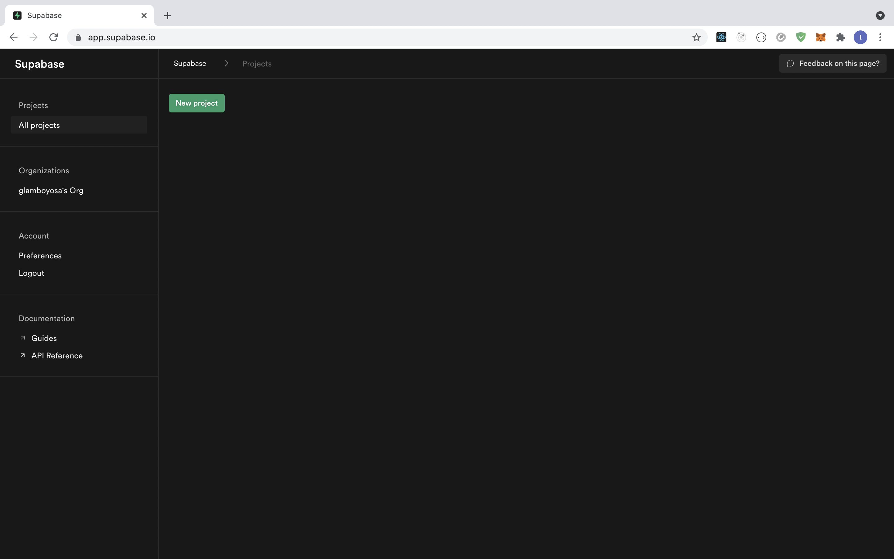
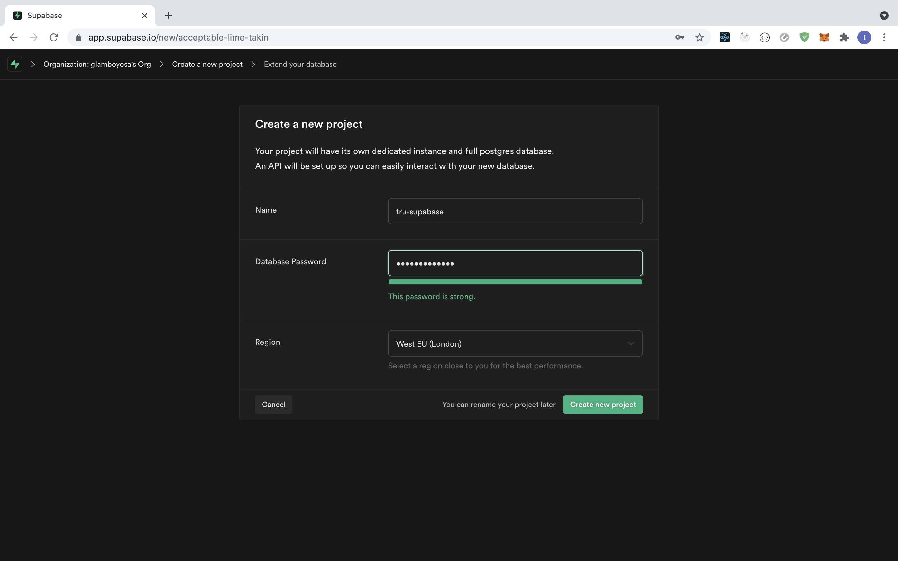
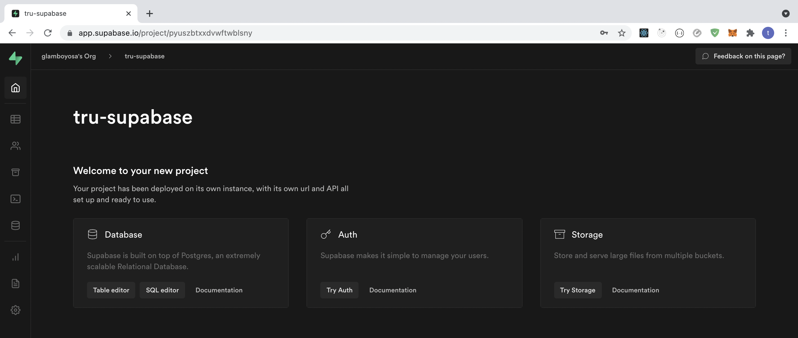
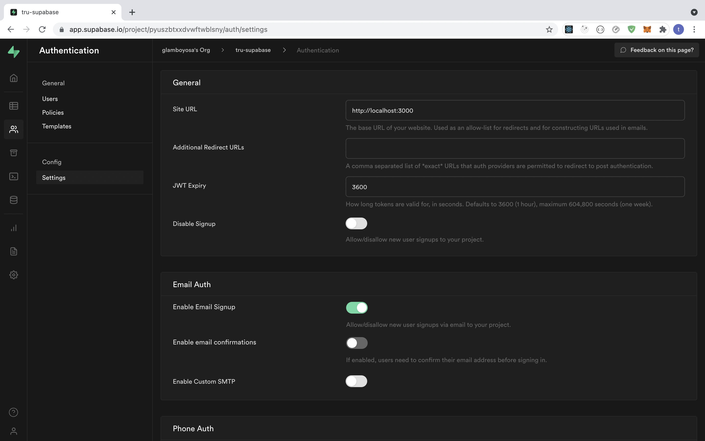

## SIM Card Based Authentication with Supabase Flutter and tru.ID PhoneCheck

## Requirements

- A [tru.ID Account](https://tru.id)
- An [Supabase Account](https://app.supabase.io)
- A mobile phone with a SIM card and mobile data connection

## Getting Started

Clone the starter-files branch via:

```bash
git clone -b starter-files --single-branch https://github.com/tru-ID/supabase-passwordless-authentication-flutter.git
```

If you're only interested in the finished code in main then run:

```bash
git clone -b main https://github.com/tru-ID/supabase-passwordless-authentication-flutter.git
```

Create a [tru.ID Account](https://tru.id)

Install the tru.ID CLI via:

```bash
npm i -g @tru_id/cli

```

Input your **tru.ID** credentials which can be found within the tru.ID [console](https://developer.tru.id/console)

Install the **tru.ID** CLI [development server plugin](https://github.com/tru-ID/cli-plugin-dev-server)

Create a new **tru.ID** project within the root directory via:

```
tru projects:create flutter-supabase-auth --project-dir .
```

Run the development server, pointing it to the directory containing the newly created project configuration. This will also open up a localtunnel to your development server making it publicly accessible to the Internet so that your mobile phone can access it when only connected to mobile data.

```
tru server -t
```

## Setting up Supbase

Create or log into a [Supabase account](https://app.supabase.io)

Once logged in, you'll see an interface like below, select "new project":



You'll be taken to the following page, ensure to input your desired credentials for example:



You'll then be redirected to the dashboard. Once there, click on the user icon on the left or "try auth" button



When you click that, you'll be taken to the following page. Click the "Settings" option and under "Email auth" , disable "Enable Email Confirmations" as shown below


Next, we need to copy our the values of the `.env.example` to `.env`:

```bash
cp .env.example .env
```

Replace `SUPABASE_URL` with the `URL` value found under "Settings > API > Config > URL" in your project dashboard.

Next, replace `SUPABASE_PUBLIC_ANON` with the `anon public` value found under "Settings > API > Project API keys > anon public"

## Run the app

To start the project, ensure you have a physical device connected then run:

```bash
flutter run
```

> **Note** For a physical iOS device ensure you've [provisioned your project in XCode](https://flutter.dev/docs/get-started/install/macos#deploy-to-ios-devices)